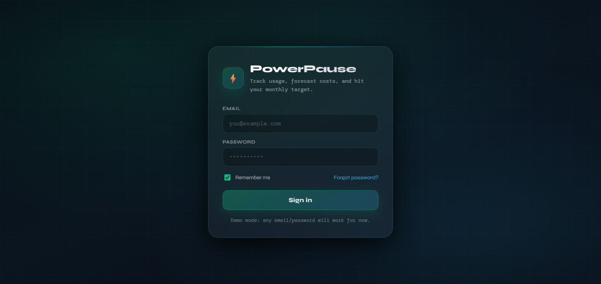
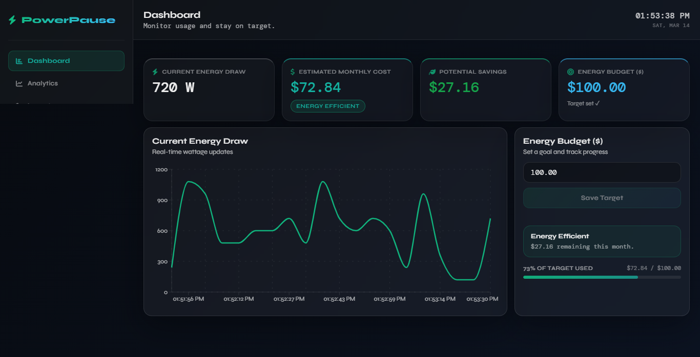
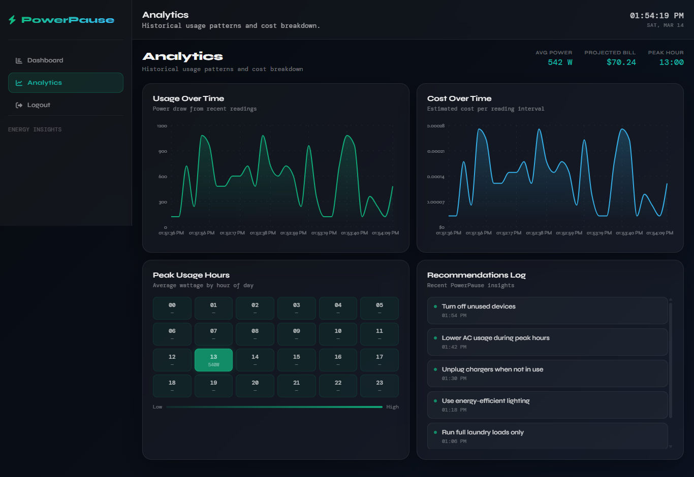

# PowerPause ⚡

> Track energy usage, forecast monthly costs, and hit your power targets — all in real time.

PowerPause is a full-stack energy monitoring dashboard built with FastAPI and React. It receives live power readings from an ESP32 device (or simulator), stores them in a Postgres database, and displays real-time analytics through a clean web interface.

---

## Screenshots

### Login


### Dashboard


### Analytics


---

## Project Structure

```
powerpause/
├── backend/          # FastAPI backend (Python)
├── frontend/         # React + Vite frontend
└── README.md
```

---

## Getting Started

### Prerequisites

- Python 3.11+
- Node.js 18+
- A Postgres database (Supabase recommended)

---

### Backend Setup

```bash
cd backend

# Create and activate virtual environment
python -m venv .venv
.venv\Scripts\activate      # Windows
source .venv/bin/activate   # Mac/Linux

# Install dependencies
pip install -r requirements.txt

# Configure environment
cp .env.example .env
# Fill in your values in .env

# Start the server
uvicorn main:app --reload --port 8081
```

The backend will be available at `http://127.0.0.1:8081`.  
API docs at `http://127.0.0.1:8081/docs`.

---

### Frontend Setup

```bash
cd frontend

# Install dependencies
npm install

# Configure environment
cp .env.example .env.local
# Fill in your values in .env.local

# Start the dev server
npm run dev
```

The frontend will be available at `http://localhost:5173`.

---

### ESP32 Simulator

To simulate power readings without hardware:

```bash
cd backend
python esp32_simulator.py
```

Make sure the backend is running first. The simulator sends a reading every 5 seconds.

---

## Environment Variables

### Backend (`backend/.env`)

| Variable | Description |
|---|---|
| `DATABASE_URL` | Postgres connection string |
| `FRONTEND_URL` | Frontend URL for CORS (e.g. `https://your-app.vercel.app`) |

### Frontend (`frontend/.env.local`)

| Variable | Description |
|---|---|
| `VITE_API_BASE_URL` | Backend API URL (e.g. `https://your-backend.onrender.com`) |

---

## Deployment

### Backend — Render

1. Create a new **Web Service** on [Render](https://render.com)
2. Connect your GitHub repo and set the root directory to `backend`
3. Set build command: `pip install -r requirements.txt`
4. Set start command: `uvicorn main:app --host 0.0.0.0 --port 8081`
5. Add environment variables in Render dashboard

### Frontend — Vercel

1. Import your GitHub repo on [Vercel](https://vercel.com)
2. Set the root directory to `frontend`
3. Add `VITE_API_BASE_URL` in Vercel project settings → Environment Variables
4. Deploy

---

## Tech Stack

| Layer | Tech |
|---|---|
| Frontend | React 18, Vite, Recharts, React Router |
| Backend | FastAPI, asyncpg, Pydantic, Uvicorn |
| Database | Postgres (via Supabase) |
| Auth | LocalStorage session (demo mode) |
| Deployment | Vercel (frontend), Render (backend) |

---

## License

MIT
